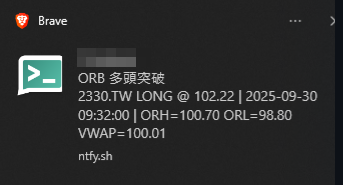

# 📈 ORB Auto Monitor (Taiwan Stock Breakout Alert via ntfy)

## 🧩 Overview
This tool monitors Taiwan stocks using the **Opening Range Breakout (ORB)** strategy and sends real-time alerts via [ntfy](https://ntfy.sh).  
It fetches 1-minute OHLC data from Yahoo Finance and pushes notifications when a stock breaks above or below the opening range.

---


## ⚙️ Features
- Monitors **multiple stocks** simultaneously.  
- Detects **breakout / breakdown** from the first N minutes of trading.  
- Sends notifications to a **custom ntfy topic**.  
- Prevents duplicate alerts (only sends once per direction).  
- Supports timezone setting (default: Asia/Taipei).  

---

## 🚀 Quick Start

### 1️⃣ Install dependencies
```bash
pip install -r requirements.txt
```

### 2️⃣ Run the monitor
```bash
python -u orb_multi_yf_ntfy.py \
  --symbols 2330.TW,2317.TW,0050.TW \
  --open-mins 15 \
  --poll-secs 30 \
  --vol-factor 1.2 \
  --timezone Asia/Taipei \
  --ntfy-topic MyStockAlert
```

💡 Replace `MyStockAlert` with your own topic name.  
You can view notifications at:
```
https://ntfy.sh/MyStockAlert
```

---

## 📊 Parameters
| Parameter | Description | Default |
|------------|--------------|----------|
| `--symbols` | Stock list (comma-separated, e.g. 2330.TW,2317.TW) | required |
| `--open-mins` | Minutes for ORB range (usually 15) | 15 |
| `--poll-secs` | Fetch interval in seconds | 30 |
| `--vol-factor` | Volume multiplier for breakout validation | 1.2 |
| `--timezone` | Timezone | Asia/Taipei |
| `--ntfy-topic` | ntfy topic name | required |

---

## 🕐 Example Workflow
1. At market open (09:00), the script collects prices for the first 15 minutes.  
2. After 09:15, if a stock price exceeds ORH or drops below ORL, it sends an alert once.  
3. Alerts are pushed to your ntfy topic:
   ```
   [ORB Breakout] 2330.TW LONG @ 795.00 | ORH=790.00 ORL=782.00 VWAP=788.50
   ```

---

## 💾 Log Output
You can redirect logs when running manually:
```bash
python -u orb_multi_yf_ntfy.py ... > orb_$(date +%Y%m%d).log 2>&1 &
```

---

## 🧠 Tips
- Recommended `vol-factor`:  
  - 1.2 = more sensitive (more alerts)  
  - 1.5 = stricter (fewer alerts)  
- Yahoo Finance data has about **15–30s delay**.  
- You can later switch to **Shioaji API** for real-time trading.

---

## 🧩 Folder Structure
```
orb-ntfy/
│
├── orb_multi_yf_ntfy.py     # Main script
├── replay_min.py            # Replay tool (for fake data testing)
├── requirements.txt         # Dependencies
└── README.md                # This file
```

---

## 📄 License
MIT License  
Feel free to modify and share.  
